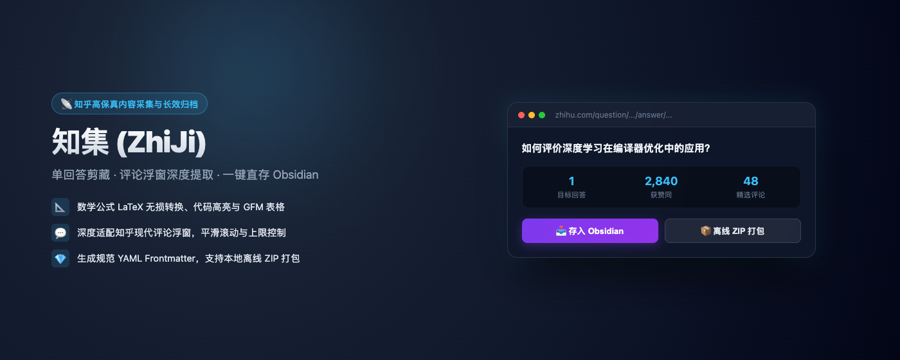

# 知集 (ZhiJi) 📡

<p align="center">
  
</p>

<p align="center">
  <b>知乎高保真内容采集与知识库归档利器</b><br>
  专栏文章 / 单回答 / 多回答自适应采集 · 高保真 Markdown · Obsidian 直存 · 本地 ZIP 打包 · 动态可视化配置
</p>

<p align="center">
  <a href="https://phpgao.github.io/zhiji/"></a>
  <a href="https://chromewebstore.google.com/detail/hahlmfehfnhebnpmgmjbbomgjghnmjnk?authuser=0&hl=zh-CN"></a>
  <a href="https://github.com/phpgao/zhiji/releases/latest"></a>
  
  
  
  
</p>

<p align="center">
  🌐 <b>官方主页 & 在线功能演示</b>：<a href="https://phpgao.github.io/zhiji/">https://phpgao.github.io/zhiji/</a><br>
  🛒 <b>Chrome 商店直达</b>：<a href="https://chromewebstore.google.com/detail/hahlmfehfnhebnpmgmjbbomgjghnmjnk?authuser=0&hl=zh-CN">https://chromewebstore.google.com/detail/hahlmfehfnhebnpmgmjbbomgjghnmjnk</a>
</p>

---

<p align="center">
  
</p>

---

## ✨ 核心特性

| 特性 | 说明 |
|---|---|
| 🌐 **官方展示主页** | 体验在线主页与安装指南：[https://phpgao.github.io/zhiji/](https://phpgao.github.io/zhiji/) |
| 🎯 **专栏文章 / 问答双场景** | 智能自适应识别：知乎专栏长文 (`/p/*`) 精准剔除侧边栏与热搜推荐；单回答页面精准剪藏；问题页面批量扫描 |
| 💬 **评论深度层级采集** | 适配现代知乎评论浮窗 Modal，支持默认排序切换、自动平滑滚动加载更多（可自定义上限 0~500 条） |
| 📝 **高保真 Markdown 引擎** | 完美转换数学公式（行内 `$..$` / 块级 `$$..$$`）、代码语法高亮、GFM 表格、引用、列表、知乎专属链接卡片 |
| 📥 **Obsidian 零感直存** | 基于官方原生 `obsidian://new` 协议，零第三方插件与 Token 依赖，一键唤起 Obsidian 写入指定 Vault 和目录 |
| 📦 **本地离线 ZIP 打包** | 自动并发下载高保真图片至本地 `images/` 目录并重写 Markdown 相对路径，即使原文被删仍永久可用 |
| ⚙️ **双入口动态可视化配置** | 彻底告别脚本硬编码！支持在**扩展工具栏弹窗**或**网页内嵌设置面板**随时修改 Vault 名称、存储路径与评论上限 |
| 🎨 **暗色毛玻璃现代 UI** | 沉浸极简设计（`backdrop-filter: blur(24px)`）、右下角无侵入悬浮胶囊、状态自愈与优雅进度提示 |

---

## 🚀 快速安装

### 方式一：Chrome 浏览器扩展 (推荐)

- **官方应用商店一键安装 (首选推荐)**：
  👉 **[Chrome Web Store 官方页面安装「知集」](https://chromewebstore.google.com/detail/hahlmfehfnhebnpmgmjbbomgjghnmjnk?authuser=0&hl=zh-CN)**
- **手动离线安装包 (开发者模式)**：
  1. 前往 [Releases 最新发布页](https://github.com/phpgao/zhiji/releases/latest) 下载最新离线安装包 `zhiji-chrome.zip` 并解压；
  2. 打开 Chrome / Edge / Brave 浏览器，地址栏输入 `chrome://extensions/`；
  3. 打开右上角的 **「开发者模式」** 开关；
  4. 点击左上角 **「加载已解压的扩展程序」**，选择解压出的目录即可。

### 方式二：Tampermonkey 油猴脚本 (一键安装)

1. 确保浏览器已安装扩展 [Tampermonkey](https://www.tampermonkey.net/) / ScriptCat / Violentmonkey；
2. 点击下方链接直接安装：
   - 👉 **[一键安装 zhiji.user.js](https://raw.githubusercontent.com/phpgao/zhiji/main/zhiji.user.js)**
   - 👉 **[Greasy Fork 安装](https://greasyfork.org/)**

---

## ⚙️ 动态配置说明

知集支持通过图形界面随时修改偏好配置，**设置后即时生效**：

- **扩展用户**：点击浏览器右上角知集插件图标，在弹窗中修改并保存；
- **油猴脚本用户**：点击网页右下角知集胶囊右侧的 **⚙️ 设置** 按钮，直接在页面弹窗中修改并保存。

| 配置项 | 默认值 | 作用 |
|---|---|---|
| `Vault (仓库名)` | `""` (默认留空) | Obsidian 知识库名称（**必填项**，未配置时引导设置） |
| `保存目录 (Folder)` | `zhihu/` | Obsidian 笔记归档子文件夹（选填，留空时保存至仓库根目录） |
| `自动展开折叠回答` | `true` | 采集时自动点击「展开全部」 |
| `包含问题描述` | `true` | 是否在导出内容头部加入问题描述正文 |
| `提取话题标签` | `true` | 提取知乎话题为 kebab-case 标签并写入 frontmatter |
| `包含回答元数据` | `true` | 保留发布时间、获赞数、评论数、原文直链 |
| `包含回答评论` | `true` | 保留评论内容（支持多级子评论、作者标识与点赞） |
| `评论抓取上限` | `100` | 评论最大抽取条数（设为 0 则跳过评论） |
| `最大回答采集上限` | `0` (不限制) | 回答列表页单次采集的最大回答条数，防知乎反爬风控（设为 0 则采集全部） |
| `包含图片离线包` | `true` | 是否在打包时下载高清图片并封装为本地 ZIP |
| `生成 YAML Frontmatter`| `true` | 生成兼容 Dataview / Obsidian 标准元数据块 |

---

## 📋 导出 YAML Frontmatter 示例

```yaml
---
title: "如何评价 Linux 内核架构？"
author: "张三"
author_url: "https://www.zhihu.com/people/zhangsan"
tags:
  - zhihu
  - software-architecture
  - operating-systems
  - linux-kernel
status: ready
source: "https://www.zhihu.com/question/2057489186660390852/answer/123456"
type: zhihu-answer
created: "2026-09-20 14:30"
upvotes: "2.3 万"
comments_count: 85
related: []
---
```

---

## 🛠️ 本地构建与 CI/CD

项目采用极速原生模块化设计，无重型打包器依赖：

```bash
# 运行单元测试
npm test

# 构建全端产物 (Chrome 扩展 dist/chrome, 油猴脚本 zhiji.user.js, Pages 静态资源)
npm run build

# 打包发布分发包 (dist/zhiji-chrome.zip 等)
npm run pack
```

本项目已配置 **GitHub Actions 自动化 CI/CD**（`.github/workflows/build-and-release.yml`）：
- 每次推送版本 Tag（`v*`）会自动运行全套测试、打包构建并生成 GitHub Release 发布包；
- GitHub Pages 主页由 GitHub 原生托管引擎自动构建部署。

---

## 📄 开源许可

[MIT License](LICENSE) © 2026 ZhiJi
